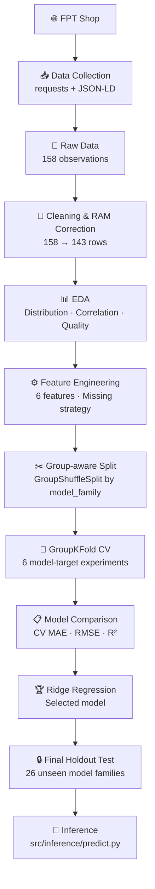

# Smartphone Price Prediction

> **Supervised Machine Learning — Regression Pipeline**
> Dự đoán giá smartphone tại thị trường Việt Nam dựa trên thông số kỹ thuật thu thập từ FPT Shop.

---


## Project Overview

| | |
|---|---|
| **Task** | Regression |
| **Data Source** | FPT Shop (public listing prices) |
| **Target** | `price_vnd` — Giá bán công khai hiện tại tại thời điểm thu thập, không gồm trade-in, voucher, trả góp |
| **Final Model** | Ridge Regression (α = 1.0, Raw target) |
| **Test MAE** | ~5.36M VNĐ |
| **Test R²** | 0.67 |

---

## Problem Statement

Giá smartphone tại Việt Nam trải dài từ dưới 3 triệu đến hơn 60 triệu VNĐ. Mục tiêu là xây dựng một baseline ML model có thể ước tính giá bán dựa trên thông số kỹ thuật cơ bản (RAM, Storage, Camera, 5G…) mà không cần truy cập dữ liệu thị trường thời gian thực.

**V1 là baseline estimator** — không phải production pricing engine.

---

## Project Pipeline



---

## Project Structure

```
Smartphone_Price_Prediction/
├── data/
│   ├── raw/
│   │   └── fptshop_smartphones.csv          # Raw collected data (immutable)
│   └── processed/
│       ├── fptshop_smartphones_clean.csv    # Clean dataset
│       ├── X_train.csv / X_test.csv         # Feature splits
│       ├── y_train.csv / y_test.csv         # Target splits
│       ├── split_manifest.csv               # Group split audit log
│       ├── model_comparison.csv             # CV results for all experiments
│       └── test_predictions.csv             # Final holdout predictions
├── models/
│   └── smartphone_price_model_v1.joblib     # Saved sklearn Pipeline
├── notebooks/
│   └── smartphone_price_prediction_presentation.ipynb
├── src/
│   ├── collection/
│   │   ├── collect.py                       # Main crawler
│   │   ├── discover.py                      # URL discovery
│   │   └── parser.py                        # JSON-LD + spec parser
│   ├── data/
│   │   └── clean.py                         # Cleaning pipeline
│   ├── analysis/
│   │   └── eda_report.py                    # EDA charts
│   ├── features/
│   │   ├── build_features.py                # Split + group logic
│   │   └── pipeline.py                      # Preprocessing factory
│   ├── models/
│   │   └── train.py                         # Training + CV + evaluation
│   └── inference/
│       └── predict.py                       # Inference layer (Phase 7)
├── tests/
│   ├── test_collection.py
│   ├── test_model.py
│   └── test_inference.py
└── requirements.txt
```

---

## Dataset

| | |
|---|---|
| **Source** | FPT Shop — `fptshop.com.vn/dien-thoai` |
| **Raw observations** | 158 |
| **Clean observations** | 143 |
| **Brands** | 11 (Apple, Samsung, Xiaomi, Oppo, Honor, Nubia, Tecno, REDMAGIC, Benco, TCL, Itel) |
| **Price range** | 2.4M – 68M VNĐ |
| **Price median** | ~9.99M VNĐ |

**Features:**

| Feature | Type | Note |
|---|---|---|
| `brand` | Categorical | 11 brands |
| `ram_gb` | Numeric | 7 rows missing (Apple) |
| `storage_gb` | Numeric | — |
| `screen_size_inch` | Numeric | — |
| `has_5g` | Categorical | Yes / No / Unknown |
| `main_camera_mp` | Numeric | 33 rows missing |
| `price_vnd` | Numeric | **Target** — 0 missing |

---

## Data Collection

- **Source:** FPT Shop only. Không sử dụng dữ liệu từ nguồn khác.
- **Method:** `requests` + `BeautifulSoup` + JSON-LD (`application/ld+json`)
- **Discovery:** Bắt đầu từ `/dien-thoai`, duyệt brand/category links, validate `@type = Product`
- **Missing specs:** Không fabricate — giữ nguyên `NaN` để pipeline xử lý
- **Raw data:** Immutable sau khi collected. Mọi thay đổi chỉ xảy ra ở `data/processed/`

---

## Data Cleaning & Data Quality

**Cleaning steps:**
1. `price_vnd <= 0` hoặc missing → Remove (invalid target)
2. Exact duplicate rows → Remove
3. RAM / Storage / Screen / Camera parsing từ chuỗi sang số
4. Feature 100% missing (`chipset`, `refresh_rate`, `release_year`) → Drop

**Data Quality Bug — RAM Parsing:**

Phát hiện trong Phase 4 (EDA): Storage (128/256/512 GB) của một số iPhone bị fallback regex gán nhầm thành `ram_gb`. Parser được sửa để:
- Chỉ nhận field có keyword `RAM`
- Hỗ trợ MB → GB conversion (`512 MB` → `0.5 GB`)

| Metric | Before Fix | After Fix |
|---|---|---|
| `ram_gb > 32` | ~20 rows | 0 ✅ |
| Apple suspicious | 20 rows | 0 ✅ |
| Inoi/Masstel MB-unit | 2 rows | 0 ✅ |

---

## Exploratory Data Analysis

- `price_vnd` lệch phải — median ~10M, mean ~15.8M, max ~68M
- `storage_gb` và `ram_gb` có xu hướng tương quan dương với giá
- `main_camera_mp` có tương quan yếu — phone giá thấp cũng thường có MP cao
- `has_5g` phân tầng tier sản phẩm nhưng 38% giá trị là Unknown

EDA charts: `data/processed/plots/`

---

## Feature Engineering

**Missing data strategy:**

| Feature | Strategy |
|---|---|
| `ram_gb` | `SimpleImputer(median)` + `MissingIndicator` |
| `main_camera_mp` | `SimpleImputer(median)` + `MissingIndicator` |
| `has_5g` | Map → `"Yes"` / `"No"` / `"Unknown"` + `OneHotEncoder` |

**Preprocessing pipeline (Ridge):**
```
Numeric → SimpleImputer(median, add_indicator=True) → StandardScaler
Categorical → SimpleImputer(most_frequent) → OneHotEncoder(handle_unknown='ignore')
→ ColumnTransformer → Ridge
```
Toàn bộ pipeline được đóng gói trong `sklearn Pipeline`. `.fit()` chỉ gọi trên Train Set.

---

## Group-aware Train/Test Split

**Vấn đề với random split:**

Nếu `iPhone 16 128GB` ở Train và `iPhone 16 256GB` ở Test → model "học vẹt" giá nền của dòng máy → Data Leakage ngầm.

**Giải pháp:**
- Group key: `model_family` (loại bỏ dung lượng/connectivity suffix khỏi `model_name`)
- Method: `GroupShuffleSplit(test_size=0.2, random_state=42)`

| Split | Rows | Model Families |
|---|---|---|
| Train | 117 | 79 |
| Test | 26 | 20 |
| **Overlap** | — | **0 ✅** |

Audit log: `data/processed/split_manifest.csv`

---

## Model Training & GroupKFold CV

**3 model families × 2 target strategies = 6 model-target experiments:**

| # | Model | Target Strategy |
|---|---|---|
| 1 | Linear Regression | Raw `price_vnd` |
| 2 | Linear Regression | `log1p(price_vnd)` |
| 3 | Ridge Regression | Raw `price_vnd` |
| 4 | Ridge Regression | `log1p(price_vnd)` |
| 5 | Random Forest | Raw `price_vnd` |
| 6 | Random Forest | `log1p(price_vnd)` |

Validation: `GroupKFold(n_splits=5)` trên Train Set. Group overlap = 0 mỗi fold.
Dummy baseline: `DummyRegressor(strategy="median")` — CV MAE ≈ 10.48M VNĐ.

---

## Model Comparison

| Experiment | CV MAE | CV RMSE | CV R² | Std MAE |
|---|---|---|---|---|
| **Ridge (Raw)** ✅ | **4.10M** | 5.68M | **0.731** | **0.22M** |
| Linear (Raw) | 4.14M | 5.65M | 0.714 | 0.36M |
| Ridge (Log) | 4.23M | 6.45M | 0.680 | 1.53M |
| Random Forest (Raw) | 4.47M | 6.75M | 0.638 | 1.07M |
| Linear (Log) | 4.52M | 7.07M | 0.601 | 1.68M |
| Random Forest (Log) | 4.56M | 6.89M | 0.631 | 1.27M |
| *Dummy Baseline* | *10.48M* | — | — | — |

**Selected:** Ridge Regression (Raw target) — Lowest CV MAE + Lowest Std MAE (stability).

> **Note:** Log target không cải thiện MAE sau khi đổi ngược về VNĐ. Random Forest thua Linear do dataset nhỏ (117 rows).

---

## Final Test Evaluation

Model Ridge (Raw) được fit trên toàn bộ 117 Train rows, sau đó evaluate trên 26 Test rows (unseen model families).

| Metric | Value |
|---|---|
| **Test MAE** | **5.36M VNĐ** |
| **Test RMSE** | **7.24M VNĐ** |
| **Test R²** | **0.6702** |

Metrics được tính trực tiếp từ `data/processed/test_predictions.csv` — không retrain.

> Test MAE (~5.36M) cao hơn CV MAE (~4.10M) do sampling variance với dataset nhỏ. Không kết luận overfitting chỉ từ hai con số này.

---

## Inference

**Source:** `src/inference/predict.py` — Phase 7

**Flow:**
```
Input dict
    ↓ validate_input()
    ↓ pd.DataFrame (1 row)
    ↓ load_model()  →  cached sklearn Pipeline
    ↓ model.predict()  [NO external preprocessing]
    ↓ Negative check
    ↓ Output dict
```

**Input schema:**

| Field | Type | Required | Rule |
|---|---|---|---|
| `brand` | `str` | ✅ | Non-empty |
| `ram_gb` | `float` | ✅ | `> 0` |
| `storage_gb` | `float` | ✅ | `> 0` |
| `screen_size_inch` | `float` | ✅ | `> 0` |
| `has_5g` | `str` | ✅ | `"Yes"` / `"No"` / `"Unknown"` |
| `main_camera_mp` | `float \| None` | ❌ Optional | `> 0` nếu có |

**Output schema:**

```json
{
    "raw_prediction_vnd": 22088444.0,
    "display_price_vnd": 22088444.0,
    "formatted_price": "22,088,444 VNĐ",
    "warning": null
}
```

Khi `raw_prediction_vnd < 0`:
- `display_price_vnd = 0` (business guardrail — không dùng để tính lại metrics)
- `warning`: mô tả rõ giới hạn của model

**Edge cases đã được xử lý:**
- Unknown brand → `OneHotEncoder(handle_unknown='ignore')` — không crash
- Missing camera → `SimpleImputer` bên trong Pipeline xử lý
- Negative prediction → giữ nguyên `raw`, thêm `warning`

**Run CLI demo:**

```bash
python -m src.inference.predict
```

---

## Results

| Metric | Value |
|---|---|
| Raw observations | 158 |
| Clean observations | 143 |
| Train / Test | 117 / 26 |
| Train / Test model families | 79 / 20 |
| Group overlap | **0** |
| Selected model | Ridge Regression |
| Target strategy | Raw `price_vnd` |
| CV MAE | **4.10M VNĐ** |
| Test MAE | **5.36M VNĐ** |
| Test RMSE | **7.24M VNĐ** |
| Test R² | **0.6702** |
| Dummy baseline CV MAE | 10.48M VNĐ |

---

## Model Limitations

Model V1 là baseline smartphone price estimator dựa trên specs kỹ thuật cơ bản. **Không phải production pricing engine.**

**Features đã có:**
`brand`, `ram_gb`, `storage_gb`, `screen_size_inch`, `has_5g`, `main_camera_mp`

**Features chưa có (cần cho V2):**

| Missing Feature | Impact |
|---|---|
| `chipset` | Không phân biệt Snapdragon 8 Elite vs Helio G85 |
| `product_generation` | iPhone 17 vs iPhone 15 — cùng RAM, khác giá |
| `display_technology` | AMOLED 165Hz vs IPS 60Hz |
| `form_factor` | Foldable vs standard |
| `camera_system_quality` | Leica / Zeiss vs generic sensor |
| `build_quality` | Titanium vs plastic |
| `release_year` | Điện thoại đời mới vs cũ |

**Known issues:**
- Ridge (Raw target) có thể sinh ra **negative prediction** cho điện thoại giá rẻ cực thấp
- `has_5g` có 38% giá trị Unknown do thiếu thông tin rõ ràng từ nguồn
- Dataset 143 rows còn nhỏ — Test MAE có thể dao động cao khi gặp các dòng máy hiếm

---

## Installation

```bash
# Clone và tạo virtual environment
git clone <repo-url>
cd Smartphone_Price_Prediction

python3 -m venv venv
source venv/bin/activate          # macOS/Linux
# venv\Scripts\activate           # Windows

pip install -r requirements.txt
```

**Dependencies (`requirements.txt`):**
```
requests
beautifulsoup4
pandas
scikit-learn
matplotlib
seaborn
pytest
jupyter
nbformat
```

---

## How to Run

> **Note:** Dataset và model artifact đã có sẵn. Không cần crawl hoặc train lại để chạy inference.

### Inference (Phase 7)

```bash
# CLI demo với fixed example input
python -m src.inference.predict
```

```python
# Sử dụng trong code
from src.inference.predict import predict_price

result = predict_price({
    "brand": "Samsung",
    "ram_gb": 12,
    "storage_gb": 256,
    "screen_size_inch": 6.7,
    "has_5g": "Yes",
    "main_camera_mp": 50
})
print(result["formatted_price"])   # "22,088,444 VNĐ"
```

### Run Tests

```bash
# All tests
pytest tests/ -v

# Inference tests only
pytest tests/test_inference.py -v
```

### Presentation Notebook

```bash
jupyter notebook notebooks/smartphone_price_prediction_presentation.ipynb
```

### Data Collection (nếu muốn thu thập lại)

```bash
python -m src.collection.collect
```

### Data Cleaning

```bash
python -m src.data.clean
```

### Feature Engineering & Split

```bash
python -m src.features.build_features
```

### Model Training

```bash
python -m src.models.train
```

---

## Future Work

| Priority | Item |
|---|---|
| 🔴 High | Thu thập thêm dữ liệu (>500 observations) |
| 🔴 High | Bổ sung feature `chipset`, `release_year`, `display_technology` |
| 🟡 Medium | Model V2 — XGBoost / LightGBM với feature set đầy đủ hơn |
| 🟡 Medium | FastAPI endpoint để serve prediction qua HTTP *(chưa implement)* |
| 🟢 Low | Simple web UI cho inference demo *(chưa implement)* |
| 🟢 Low | Automated re-collection schedule để cập nhật giá mới |

